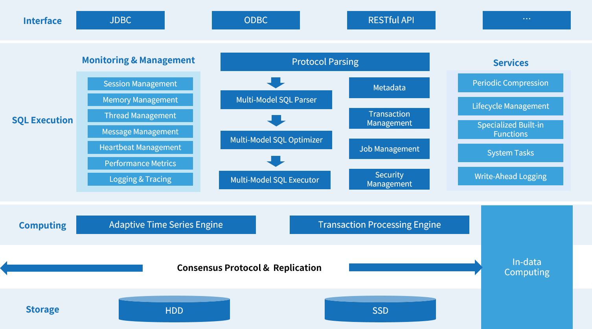

# KWDB

English | [简体中文](./README.md)

## About KWDB

**KWDB is a distributed multi-model database tailored for AIoT scenarios.** It supports the concurrent creation of time-series and relational databases within the same instance and the integrated processing of multi-model data. KWDB can process time-series data with high efficiency. It supports tens of millions of device connections, millions of data points written per second, and hundreds of millions of data points read per second. It features stability & security, high availability, and easy maintenance. For a full list of supported features, see [Feature Overview](https://kaiwudb.com/kaiwudb_docs/#/about-kaiwudb/supported-functions.html).



KWDB is the community version of KaiwuDB, a distributed multi-model database developed by Inspur. **It is mainly used in fields such as IoT, energy, power, IoV (Internet of Vehicles), smart government, IT operation management, and securities.**  KWDB is dedicated to offer a comprehensive platform for data storage, management, and analysis across various industries, supporting enterprises in their digital transformation and unlocking greater value from their data at lower costs.

**KWDB offers** extensive support for different roles:

- **For developers:** KWDB offers general connectivity interfaces with features such as high-speed writing & querying, SQL support, on-demand compression, data lifecycle management, and cluster deployment. Its seamless integration with third-party tools can help reduce the difficulty of development and learning while enhancing development efficiency.
- **For operation specialists**: KWDB provides quick installation, deployment, upgrade, migration, and monitoring, significantly reducing the costs for database operations management.

**Keywords**

IoT, multi-model database, distributed, time-series data processing, native AI, cloud-edge synchronization.

## Resource Download

**Accessing Resources**: To access and download KWDB community resources, including articles, documentation, source code, and binary executables, you only need to log in with your Gitee account.

**Using Resources**: You can use the downloaded resources directly. Be sure to cite KWDB articles and documents appropriately. Any modifications to the source code must comply with the [MulanPSL2 license](http://license.coscl.org.cn/MulanPSL2). If you encounter issues with binary files, report them to the community through [Issue Reports](https://gitee.com/kwdb/kwdb/issues).

## Compilation and Installation

KWDB supports installation and trial use via binary packages, container images, and source code according to your needs.

- **Binary Packages**: Support single-node and cluster deployments in both secure and non-secure modes. For more information, see [Single-Node Deployment](https://kaiwudb.com/kaiwudb_docs/#/quickstart/install-kaiwudb/quickstart-bare-metal.html) and [Cluster Deployment](https://kaiwudb.com/kaiwudb_docs/#/deployment/overview.html).
- **Container Images**: Currently, KWDB does not provide downloadable container images. For container deployment, please contact [KWDB Technical Support](https://kaiwudb.com/support/).
- **Source Code**: Source code compilation currently supports single-node non-secure deployment.

The following guide is only applicable for compiling and installing KWDB from source code.

### OS and Software Dependencies

KWDB supports installation and deployment on Linux operating systems. The table below lists the software dependencies required for compiling and running KWDB.

**Compilation Dependencies:**

| Dependency          | Version | Description                                                   |
| :------------------ | :------ | :------------------------------------------------------------ |
| ca-certificates     | any     |                                                               |
| Go                   | v1.15+  |                                                               |
| CMake               | v3.23   |                                                               |
| Autoconf            | v2.68+  |                                                               |
| goyacc              | v0.8.0+ |                                                               |
| dpkg-dev            | any     | Only applicable for Ubuntu systems.                          |
| devscripts          | any     | Only applicable for Ubuntu systems.                           |
| build-essential     | any     |                                                               |
| checkinstall        | any     |                                                               |
| libssl              | v1.1.1+ | - For Ubuntu systems, the dependency is named as libssl-dev.<br/>- For RHEL, CentOS, Kylin, UOS, and AnolisOS systems, the dependency is named as libssl-devel. |
| libprotobuf         | v3.6.1+ | - For Ubuntu systems, the dependency command is libprotobuf-dev.<br/>- For RHEL, CentOS, Kylin, UOS, and AnolisOS systems, the dependency is named as libprotobuf-devel. |
| liblzma             | v5.2.0+ | - For Ubuntu systems, the dependency is named as liblzma-dev.<br>- For RHEL, CentOS, Kylin, UOS, and AnolisOS systems, the dependency is named as liblzma-devel. |
| libncurses          | v6.2.0+ | - For Ubuntu systems, the dependency is named as libncurses5-dev.<br>- For RHEL, CentOS, Kylin, UOS, and AnolisOS systems, the dependency is named as libncurses-devel. |
| libatomic           | v7.3.0+ | Required only for GCC and G++ versions 7.3.0 and above.      |
| libstdc++-static    | v7.3.0+ | Required only for GCC and G++ versions 7.3.0 and above.      |
| protobuf-compiler   | any     |                                                               |
| git                 | any     |                                                               |

**Running Dependencies:**

| Dependency       | Version                                               |
| :--------------- | :---------------------------------------------------- |
| openssl          | v1.1.1+                                               |
| protobuf         | v3.5.0+                                               |
| geos             | v3.3.8+                                               |
| xz-libs          | v5.2.0+                                               |
| squashfs-tools   | any                                                   |
| libgcc           | v7.3.0+                                               |
| mount            | any                                                   |
| squashfuse       | any                                                   |

### Environment Preparation

1. Download and extract [the CMake installation package](https://cmake.org/download/).

   ```Bash
   tar -C /usr/local/ -xvf cmake-3.23.4-linux-x86_64.tar.gz
   mv /usr/local/cmake-3.23.4-linux-x86_64 /usr/local/cmake
   ```

2. Download and extract [the Go installation package](https://golang.google.cn/dl/).

   ```Bash
   tar -C /usr/local -xvf go1.22.5.linux-amd64.tar.gz
   ```

3. Create a directory for the project.

   ```Bash
   mkdir -p /home/go/src/gitee.com
   ```

4. Set environment variables for Go and CMake.

   - Individual users: Modify the `~/.bashrc` file.

   - System-wide settings (root permissions needed): Modify the `/etc/profile` file.

      ```Bash
      export GOROOT=/usr/local/go
      export GOPATH=/home/go      # here using /home/go as an example
      export PATH=$PATH:/usr/local/go/bin:/usr/local/cmake/bin
      ```

5. Apply the environment variable settings:

   - Individual users:

      ```Shell
      source ~/.bashrc                           
      ```

   - System-wide settings:

      ```Shell
      source /etc/profile                           
      ```

### Downloading Code

Download the code from the [KWDB code repository](https://gitee.com/kwdb/kwdb) and store it in the directory declared by `GOPATH`.

- Use `git` commands:

   ```Bash
   git clone https://gitee.com/kwdb/kwdb.git /home/go/src/gitee.com/kwbasedb # Do not modify src/gitee.com/kwbasedb in the directory path.
   cd /home/go/src/gitee.com/kwbasedb
   git submodule update --init  # For the first-time code pull
   git submodule update --remote
   ```

- Download the code archive and extract it to the specified directory.

### Building and Installing

1. Create and change to the build directory in the project directory.

   ```Bash
   cd /home/go/src/gitee.com/kwbasedb
   mkdir build && cd build
   ```

2. Run the CMake command.

   ```Bash
   cmake .. -DCMAKE_BUILD_TYPE=[Release | Debug ]
   ```

   `CMAKE_BUILD_TYPE`: the build type. The default is `Debug`. Optional values include `Debug` and `Release`, with the initial letter capitalized.

3. Disable Go modules.

   1. Set the environment variable.

      - Individual users: Modify the `~/.bashrc` file.

      - System-wide settings (requires root permissions): Modify the `/etc/profile` file.

         ```Shell
         export GO111MODULE=off         
         ```

   2. Apply the environment variable settings:

      - Individual users:

        ```Shell
        source ~/.bashrc         
        ```

      - System-wide settings:

        ```Shell
        source /etc/profile 
        ```

4. Compile and install the project.

   > **Note:**
   > If there is an error due to legacy protobuf autogenerated files during code compilation, use `make clean` to clean the build directory.

   ```Shell
   make      
   make install      
   ```

   The file list after successful compilation and installation is as follows:

   ```Plain
   /home/go/src/gitee.com/kwbasedb
   ├── install
   │   ├── bin
   │   │   ├── err_inject.sh
   │   │   ├── query_kwbase_status.sh
   │   │   ├── query_status.sh
   │   │   ├── setup_cert_file.sh
   │   │   ├── utils.sh
   │   │   └── kwbase
   │   └── lib
   │       ├── libcommon.so
   │       └── libkwdbts2.so
   ```

5. (Optional) In the directory where the `kwbase` script is located, check the database version to verify if the installation is successful.

   ```Bash
   ./kwbase version
   ```

   Example output:

   ```Plain
   KaiwuDB Version:  V2.0.3.2_RC3-3-gfe5eeb853e-dirty
   Build Time:       2024/07/19 06:24:00
   Distribution:
   Platform:         linux amd64 (x86_64-linux-gnu)
   Go Version:       go1.22.5
   C Compiler:       gcc 11.4.0
   Build SHA-1:      fe5eeb853e0884a963fd43b380a0b0057f88fb19
   ```

### Starting the Database

1. Switch to the directory where the `kwbase` script is located.

   ```Bash
   cd /home/go/src/gitee.com/kwbasedb/install/bin
   ```

2. Set the search path for shared libraries.

   ```Bash
   export LD_LIBRARY_PATH=../lib
   ```

3. Start the database.

   ```Bash
   ./kwbase start-single-node --insecure --listen-addr=:26257 --background
   ```

4. After the database starts, it can be connected and used via the KaiwuDB Developer Center or connectors like KaiwuDB JDBC driver. For detailed instructions, see [Connecting to KWDB using KaiwuDB Developer Center](https://gitee.com/kwdb/docs/blob/master/quickstart/access-kaiwudb/access-kaiwudb-kdc.md) and [Connecting to KWDB using JDBC](https://gitee.com/kwdb/docs/blob/master/quickstart/access-kaiwudb/access-kaiwudb-jdbc.md).

## Community

### Community Organization

You are more than welcome to join our community organization! For details, please see our [Community Structure](https://gitee.com/kwdb/community#社区组织架构).

### Community Contribution

Everyone is welcome to contribute. For details, please see our [Community Contribution Guideline](https://gitee.com/kwdb/community/blob/master/Contribute_process.md).

## Use Cases

KWDB can be used in various fields such as industrial IoT, digital energy, digital government, and finance. For more information, please see [Use Cases](https://gitee.com/link?target=https%3A%2F%2Fkaiwudb.com%2Fcase%2F).

## Release Notes

For the latest updates and changes, please see [Release Notes](https://gitee.com/kwdb/docs/blob/master/release-notes/release-notes.md).

## License

[MulanPSL2](http://license.coscl.org.cn/MulanPSL2)

## Contact Us

### **Join KWDB Community**

To interact and connect with KWDB users, scan the QR code below (note: Gitee). Our assistant will help you join the community.


### KaiwuDB Accounts

Official Website: https://www.kaiwudb.com/

Follow us on WeChat: Scan the QR code to follow our WeChat account: KaiwuDB

